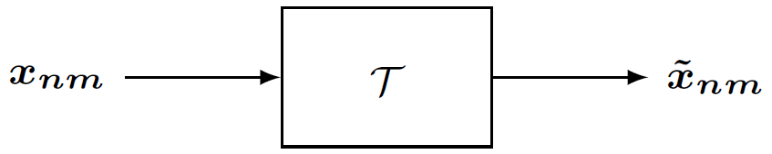
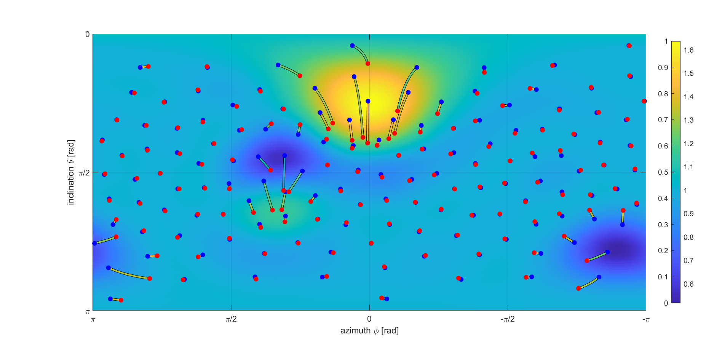

# Visualization of Linear Operations in the Spherical Harmonics Domain

This repository contains the companion MATLAB code for the 2021 publication "Visualization of Linear Operations in the Spherical Harmonics Domain" by Maximilian Kentgens and Peter Jax. Find the [paper on IEEE Xplore](https://ieeexplore.ieee.org/document/9610968). A [pre-print is available on arXiv](https://arxiv.org/abs/2104.13069).



The proposed method allows to visualize arbitrary linear operations in the spherical harmonics domain. Such operations comprise rotations, spatially selective filters, and many other modifications for various applications, or describe a MIMO system's response to an excitation.

For instance, the following MATLAB code:
```matlab
load('examples/example_adaptive_space_warping.mat','T');
visualizeTransformation(T);
```
creates the following plot:


Note that we use real-valued N3D-normalized spherical harmonics.

---

Cite this project as follows:
>  M. Kentgens and P. Jax, "Visualization of Linear Operations in the Spherical Harmonics Domain," in Proceedings of International Conference on Immersive and 3D Audio (I3DA), Sept. 2021, doi: 10.1109/I3DA48870.2021.9610968.

---

[](http://creativecommons.org/licenses/by/4.0/)
This work is licensed under a [Creative Commons Attribution 4.0 International License](http://creativecommons.org/licenses/by/4.0/).
